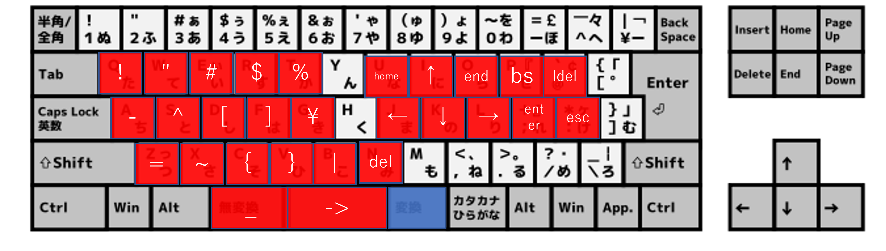
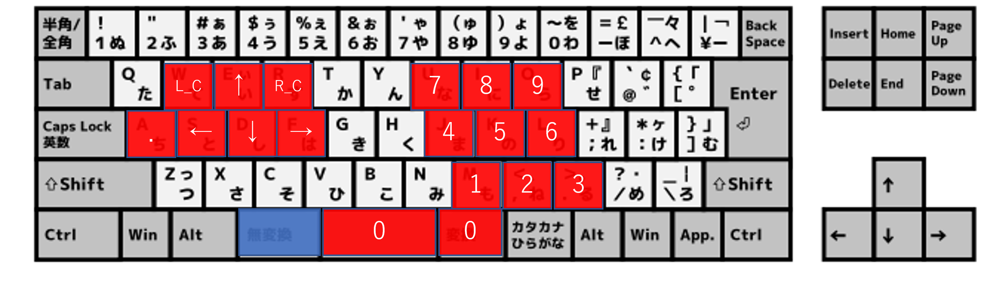

# autohotkey
- `C:\Users\ユーザ名\AppData\Roaming\Microsoft\Windows\Start Menu\Programs\Startup`にショートカットを配置するとWindows起動時に実行されます

## キーバインドマップ
 
 

|||
|:-:|:-:|
|**無変化+左手**|
|`無変換+q`|`ESC`|
|`無変換+a`|`.`|
|`無変換+w`|`マウスクリック`|
|`無変換+r`|`マウス右クリック`|
|`無変換+e`|`カーソル↑`|
|`無変換+s`|`カーソル←`|
|`無変換+d`|`カーソル↓`|
|`無変換+f`|`カーソル→`|
|`無変換+z+e`|`低速カーソル↑`|
|`無変換+z+s`|`低速カーソル←`|
|`無変換+z+d`|`低速カーソル↓`|
|`無変換+z+f`|`低速カーソル→`|
|`無変換+x`|`マウスホイール↓`|
|`無変換+z+x`|`マウスホイール↑`|
|`無変換+c`|`左のタブへ移動`|
|`無変換+v`|`右のタブへ移動`|
|**無変換+右手**|
|`無変換+m`|`1`|
|`無変換+,`|`2`|
|`無変換+.`|`3`|
|`無変換+j`|`4`|
|`無変換+k`|`5`|
|`無変換+l`|`6`|
|`無変換+y`|`6`|
|`無変換+u`|`7`|
|`無変換+i`|`8`|
|`無変換+o`|`9`|
|`無変換+space`|`0`|
|`無変換+変換`|`0`|
|`無変換+;`|`Enter`|
|`無変換+p`|`BS`|
|`無変換+/`|`del`|
|`無変換+@`|`1行削除`|
|`無変換+:`|`ESC`|
|**変換+左手**`|
|`変換+q`|`!`|
|`変換+w`|`"`|
|`変換+e`|`#`|
|`変換+r`|`$`|
|`変換+t`|`%`|
|`変換+a`|`-`|
|`変換+z`|`=`|
|`変換+s`|`^`|
|`変換+x`|`~`|
|`変換+d`|`[`|
|`変換+c`|`{`|
|`変換+f`|`]`|
|`変換+v`|`}`|
|`変換+g`|`\`|
|`変換+b`|`|`|
|`変換+無変換`|`_`|
|**変換+右手**|
|`変換+i`|`↑`|
|`変換+j`|`←`|
|`変換+k`|`↓`|
|`変換+l`|`→`|
|`変換+u`|`Home`|
|`変換+o`|`End`|
|`変換+m`|`PgUp`|
|`変換+,`|`PgDn`|
|`変換+.`|`ローマ字にする`|
|`変換+;`|`Enter`|
|`変換+p`|`BS`|
|`変換+/`|`del`|
|`変換+@`|`1行削除`|
|`変換+:`|`ESC`|
|**括弧の補完(コメントアウト済み)**|
|`LShift+[`|`[]`|
|`LShift+{`|`{}`|
|`LShift+7`|`''`|
|`LShift+@`|``|
|`RShift+2`|`""`|
|**その他**|
|`LShiht+RShift`|`大文字小文字の切り替え`|
|`RShiht+LShift`|`大文字小文字の切り替え`|

## ToDo
- `無変換+w`で、左クリックしっぱなしにする
- `変換+/+j`で、winキーを離さないままにする